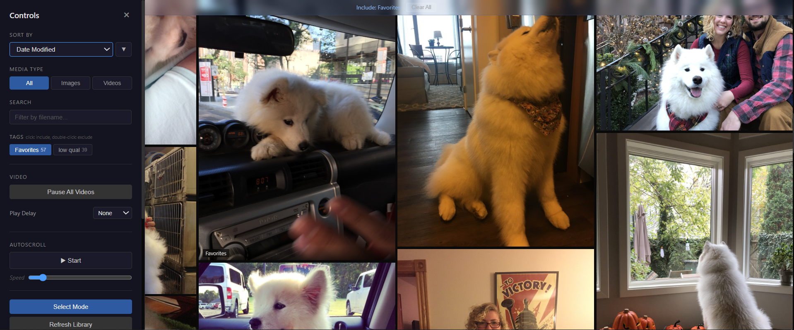

# Media Wall

A local, browser-based media viewer that displays images and videos in an elegant, edge-to-edge masonry grid.



Built as a local-first alternative to cloud photo services — same beautiful viewing experience, but without giving up control of your files. I use it in lieu of Google Photos, which I find to be a creepy app that's difficult to disconnect from.

## Key Features

- **Masonry grid layout** — Dense, beautiful wall with minimal gaps. Configurable column and gap width.
- **Video autoplay** — Videos play silently as you scroll, pause and unload when off-screen to free memory.
- **Configurable video delay** — Set a delay before videos begin playing (0s to 3s).
- **Global video pause** — Freeze all grid videos with one button or keystroke.
- **Click-to-isolate lightbox** — Full-res images and videos with controls, sound, and loop toggle.
- **Tagging system** — Tag items for grouping and filtering. Hover to see, click to edit in lightbox.
- **Tag include/exclude filtering** — Include tags (blue) to show only matching items, exclude tags (red) to hide them.
- **Bulk operations** — Select Mode for multi-select tagging and deleting.
- **Sorting & filtering** — Sort by date/name/size/type, filter by tag or media type, search by filename.
- **Autoscroll** — Hands-free gallery mode with real-time adjustable speed.
- **Soft delete** — Trashed files move to `.trash/`, recoverable by moving them back.
- **Dark theme** — Media-focused design, minimal chrome, everything gets out of the way.

## Installation

```bash
cd media_wall
pip install -r requirements.txt
```

**Dependencies:** Flask, Pillow, opencv-python-headless

**Requirements:** Python 3.10+, a modern web browser

## Configuration

Edit `config.ini` to set your media directory and preferences:

```ini
[server]
port = 5000

[media]
# Set this to your media folder — the only required setting
media_directory = C:\Users\YourName\Pictures\Media

[grid]
# Base column width in pixels — browser zoom changes how many columns fit
column_width = 350
# Gap between grid items in pixels
grid_gap = 2

[autoscroll]
# Default speed (1 = slow, 5 = moderate, 10 = fast)
speed = 2
# What happens at the bottom: loop or stop
bottom_behavior = loop

[pagination]
# Items loaded per batch during infinite scroll
batch_size = 50
```

## Usage

```bash
# Start with config.ini settings (recommended — set media_directory once)
python media_wall.py

# Override media directory from command line
python media_wall.py --media-dir "C:/Photos"

# Custom port, don't auto-open browser
python media_wall.py --port 8080 --no-browser

# Help
python media_wall.py --help
```

The server starts and opens your browser automatically. Drop your `.jpg` and `.mp4` files into the configured media directory, then click "Refresh Library" in the control panel to pick up new files.

## Keyboard Shortcuts

| Key | Action |
|-----|--------|
| `F` | Toggle control panel |
| `S` | Toggle Select Mode (multi-select) |
| `V` | Pause/resume all grid videos |
| `Space` | Toggle autoscroll |
| `Esc` | Close lightbox or panel |
| `Left/Right` | Navigate in lightbox |

## Feature Guide

### The Grid
The main view is a masonry grid that fills the entire browser window. Images display at optimized resolution for fast loading. Browser zoom (`Ctrl +/-`) controls how many columns fit on screen — zoom out for more columns, zoom in for fewer, larger images.

### Video Autoplay & Memory
Videos play automatically (muted) as they scroll into view. When a video scrolls out of view, its source is fully unloaded from memory — only the poster frame (first frame) remains. This keeps memory usage low even with hundreds of videos. When you scroll back, the video reloads and plays again.

Use the **Video** section in the control panel to:
- **Pause All Videos** — freeze every video in the grid
- **Play Delay** — add a delay (0.5s–3s) before videos start, so you can scroll past without triggering every one

### Lightbox
Click any item to open it full-size in a lightbox overlay. Images display at full original resolution. Videos get full playback controls with unmuted audio.

- Navigate with **arrow keys** or the on-screen buttons
- When filters are active, navigation steps through only the filtered set
- Videos have a **loop toggle** button (persists across navigation)
- **Delete button** moves the current item to trash (with confirmation)
- **Tag editor** lets you add/remove tags inline (type and press Enter)

### Tagging
Tags are the primary organizational tool. Each item can have multiple tags.

- **Hover** over a grid item to see its tags
- **Lightbox** shows editable tag chips — click X to remove, type to add
- **Autocomplete** suggests existing tags as you type, with keyboard navigation
- **Select Mode** (`S` key) enables multi-select: click items to select them, then use the bulk action bar to tag or delete multiple items at once

### Tag Filtering (Include & Exclude)
The wall starts empty by design — pick what you want to look at from the control panel (`F` key) before content loads. This keeps a fresh launch from immediately autoplaying every video in a large library.

In the control panel, each tag has three states — click to cycle through:
1. **Neutral** (gray) — no effect on filtering
2. **Include** (blue) — only show items that have this tag
3. **Exclude** (red, strikethrough) — hide items that have this tag

Multiple include tags use AND logic — items must have *all* selected include tags to show. Exclude removes anything matching any of the excluded tags.

**`(untagged)` virtual chip:** A pinned italic chip at the top of the tag list matches items that have no tags. Useful for flat folders where nothing has been tagged yet — click it once to show everything in the directory.

### Sorting & Filtering
The control panel (`F` key or hamburger icon) provides:
- **Sort** by date modified, filename, file size, or file type (ascending/descending)
- **Media type** filter: All / Images Only / Videos Only
- **Search** by filename (debounced, 300ms)
- **Active filter indicator** bar at the top shows what's filtered, with a "Clear All" button

### Autoscroll
Toggle autoscroll from the control panel or with `Space`. The wall scrolls downward at the configured speed. The speed slider adjusts in real-time while scrolling. Any manual scroll input (mouse wheel, arrow keys) pauses autoscroll. At the bottom, it loops back to the top (configurable to stop instead).

### Soft Delete
Deleting (from lightbox or bulk select) moves files to `.trash/` inside your media directory — nothing is permanently destroyed. To recover a file, just move it back from `.trash/` to the main directory.

## Architecture

```
media_wall/
├── media_wall.py              # Flask backend — scanner, API, file serving
├── config.ini                 # User configuration (media path, grid, etc.)
├── requirements.txt           # Python dependencies
├── .gitignore                 # Excludes caches, metadata, config
├── templates/
│   └── index.html             # Main page (Jinja2 template)
└── static/
    ├── css/
    │   └── style.css          # Dark theme, masonry grid, lightbox, panel, modals
    └── js/
        ├── wall.js            # Grid rendering, infinite scroll, pagination
        ├── video.js           # Video autoplay, unload, global pause, play delay
        ├── lightbox.js        # Full-res viewer, navigation, loop toggle
        ├── tags.js            # Tag CRUD, hover display, Select Mode, bulk actions
        ├── autocomplete.js    # Reusable tag autocomplete dropdown
        └── controls.js        # Control panel, sort/filter/search, autoscroll
```

### Backend (`media_wall.py`)
Single-file Flask application. Handles:
- **File scanning** — recursive directory walk, excluding `.trash/`, `.posters/`, `.optimized/`
- **Image optimization** — Pillow resizes images to ~1200px wide for grid display, caches in `.optimized/`
- **Video poster frames** — OpenCV extracts first frame from each video, caches in `.posters/`
- **Metadata** — `media_wall_meta.json` stores tags per file, keyed by relative path
- **REST API** — paginated media listing with sort/filter/search, tag CRUD, scan trigger, soft delete
- **File serving** — separate routes for original, optimized, and poster files

### Frontend (vanilla HTML/CSS/JS)
No frameworks, no build tools. Six JS modules communicate through global objects (`Wall`, `VideoManager`, `Lightbox`, `Tags`, `Controls`, `Autocomplete`).

### API Endpoints

| Method | Endpoint | Purpose |
|--------|----------|---------|
| GET | `/api/media` | Paginated media listing (sort, filter, search params) |
| POST | `/api/scan` | Trigger rescan of media directory |
| GET | `/api/tags` | List all tags with item counts |
| POST | `/api/tags` | Add tags to items |
| DELETE | `/api/tags` | Remove tags from specified items |
| DELETE | `/api/tags/<tag_name>` | Remove a tag globally from every item |
| POST | `/api/delete` | Soft-delete items (move to .trash/) |
| POST | `/api/pick-folder` | Open native folder picker (subprocess) |
| POST | `/api/set-media-dir` | Switch active media directory at runtime |
| GET | `/media/original/<path>` | Serve full-resolution file |
| GET | `/media/optimized/<name>` | Serve optimized grid image |
| GET | `/media/poster/<name>` | Serve video poster frame |

### Data Storage
All data lives inside the user's media directory:
- `media_wall_meta.json` — tags, file metadata, scan timestamp
- `.optimized/` — resized grid images (auto-generated, safe to delete)
- `.posters/` — video first-frame images (auto-generated, safe to delete)
- `.trash/` — soft-deleted files (manually recoverable)

## Supported Formats

- **Images**: `.jpg`, `.jpeg`
- **Videos**: `.mp4`

## Development History

This tool was built using a PRD-driven workflow with AI-assisted development. The original artifacts are kept in-repo as a record of how the project came together:

- **PRD** — [`0001-prd-media-wall.md`](0001-prd-media-wall.md) — full requirements, resolved through two rounds of clarifying questions
- **Task list** — [`tasks-0001-prd-media-wall.md`](tasks-0001-prd-media-wall.md) — 8 parent tasks, 57 sub-tasks, executed sequentially with verification at each step
- **Post-launch iteration** — autoscroll fix, tag exclusion filtering, video pause/delay, lightbox loop toggle, and tag autocomplete added after user testing

These are historical artifacts, not setup instructions — the README above is the current source of truth for using and modifying the tool.

## Build a Standalone Executable

For non-Python users (or to deploy without a Python install), Media Wall can be packaged as a single Windows `.exe` using PyInstaller.

```bash
pip install pyinstaller
build.bat
```

The build script bundles the Flask app, all static assets, and templates into `dist/media_wall.exe`. Double-click the executable, pick a media folder when prompted, and your browser opens automatically — no Python required.

## License

MIT License — see [LICENSE](LICENSE)
